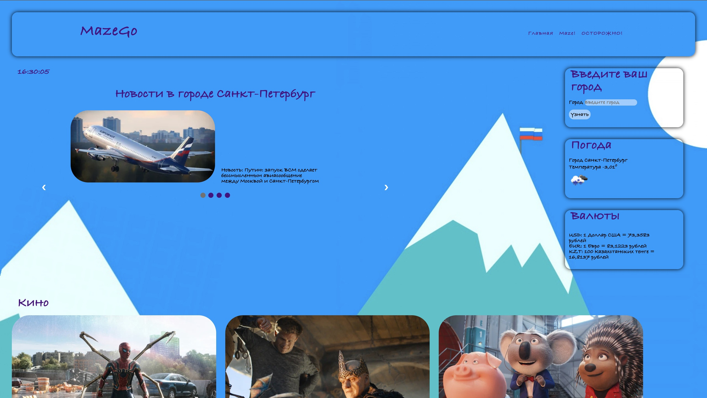

# ***MazeGo***
## Проект по дисциплине языки и методы программирования.

MazeGo является адптивным веб-сайтом, написанным с использованием фреймворка django.
В функционал сайта входит, новостная лента, погодное приложение, киноафиша, крус валют и мини-игра - pacman, а точнее ее облегченный вариант.
Также на сайте есть часы, а фон сайта зависит от времени суток.
* Утренняя тема

* Дневная тема

* Вечерняя тема

* Ночная тема

Новостная лента и киноафиша формируются на основании города, введенного пользователем.
